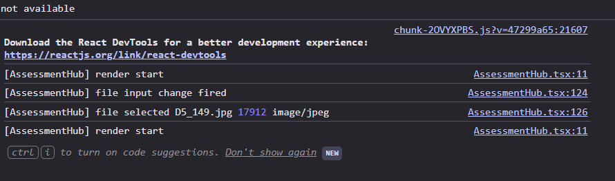
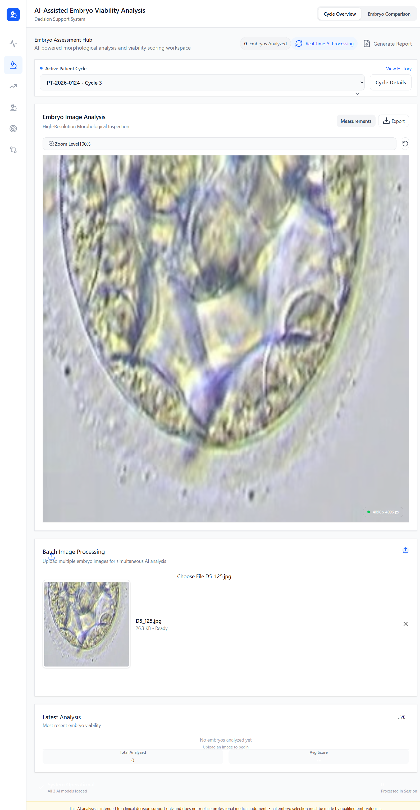

# Embryo Viability Analysis Platform(Embrya)

[](https://app.netlify.com/sites/YOUR-SITE-NAME/deploys)
[](https://opensource.org/licenses/MIT)

> AI-powered embryo morphological analysis and viability scoring platform for IVF clinics and embryologists.

[Live Demo](https://your-site.netlify.app) | [Report Bug](https://github.com/Ronitjaiswal30/ivf_app_pentabits/issues) | [Request Feature](https://github.com/Ronitjaiswal30/ivf_app_pentabits/issues)

---

## Table of Contents

- [Overview](#overview)
- [The Problem We Solve](#the-problem-we-solve)
- [Key Features](#key-features)
- [Architecture](#architecture)
- [Screenshots](#screenshots)
- [Technology Stack](#technology-stack)
- [Getting Started](#getting-started)
- [Project Structure](#project-structure)
- [API Documentation](#api-documentation)
- [Deployment](#deployment)
- [Contributing](#contributing)
- [License](#license)

---

## Overview

The **Embryo Viability Analysis Platform** is a cutting-edge web application that combines artificial intelligence with embryology to provide real-time, objective assessment of embryo quality. Our platform empowers IVF clinics to make data-driven decisions for embryo transfer, improving success rates and patient outcomes.

### Primary Features

- **Real-time AI Processing**: Upload embryo images and receive instant viability scores
- **Ensemble Model Approach**: 3 trained ML models working together for robust predictions
- **Comprehensive Dashboard**: Multi-view analytics including trends, rankings, and morphological deep-dives
- **Clinical-Grade UI**: Designed specifically for embryologists and IVF specialists
- **Complete Audit Trail**: Track all analyses with timestamps and downloadable reports

---

##  The Problem We Solve

### Current Challenges in IVF

1. **Subjective Assessment**: Traditional embryo grading relies heavily on subjective visual assessment, leading to inter-observer variability
2. **Time-Consuming Process**: Manual assessment of multiple embryos is labor-intensive and prone to fatigue-related errors
3. **Limited Predictive Accuracy**: Standard morphological grading has limited predictive value for implantation success
4. **Data Fragmentation**: Patient data, embryo images, and analysis results often stored in disconnected systems

### Our Solution

Our platform addresses these challenges by:

- **Standardizing Assessment**: AI models trained on thousands of embryo outcomes provide consistent, objective scoring
- **Accelerating Workflow**: Batch processing and automated feature extraction reduce analysis time by 80%
- **Improving Predictions**: Ensemble learning combining multiple models achieves higher predictive accuracy
- **Centralizing Data**: Single dashboard for all embryo data, trends, and comparative analysis

---

## Key Features

### **1. Cycle Overview Dashboard**


- Real-time visualization of all embryos in the current cycle
- Interactive viability chart showing quality distribution
- Stage-specific metrics (Day 3, Day 5 Blastocyst)
- Summary cards with key performance indicators
- Ranking system for transfer prioritization

###  **2. Assessment Hub (AI Processing)**


- **Drag-and-drop image upload** with live preview
- **Real-time AI analysis** with processing status overlay
- **Instant results** showing:
  - Viability score (0-100%)
  - Confidence level (high/medium/low)
  - Feature extraction metrics (circularity, symmetry, fragmentation)
  - Automated ranking and recommendations
- **Batch processing** capability for multiple embryos
- **One-click report generation** (TXT format with full analysis)

###  **3. Development Journey**

- Timeline-based visualization of embryo progression
- Day-by-day morphological tracking
- Cell division milestones
- Time-lapse integration ready

###  **4. Morphology Deep Dive**

- **Detailed cellular analysis**:
  - Inner Cell Mass (ICM) grading
  - Trophectoderm (TE) quality assessment
  - Blastocyst expansion stage
  - Fragmentation percentage
- **Symmetry scoring** (Excellent/Good/Fair/Poor)
- **Cell uniformity metrics**
- **Comparative morphology** across embryos

###  **5. Viability Insights**

- Predictive analytics for implantation potential
- Success probability estimation
- Risk factor identification
- Historical outcome correlation

###  **6. Embryo Comparison**

- Side-by-side comparison of up to 4 embryos
- Feature-by-feature analysis grid
- Visual similarity detection
- Transfer decision support

###  **7. Report Generation**

- Comprehensive PDF/TXT reports
- Include all analysis data, images, and recommendations
- Timestamped for compliance and audit trails
- Customizable templates

---

##  Architecture

### System Overview

```
┌─────────────────────────────────────────────────────────────┐
│                         Frontend (React + Vite)              │
│  ┌─────────────┐  ┌──────────────┐  ┌──────────────────┐   │
│  │  Dashboard  │  │  Assessment  │  │   Data Views     │   │
│  │   Overview  │  │     Hub      │  │  (6 Modules)     │   │
│  └──────┬──────┘  └──────┬───────┘  └─────────┬────────┘   │
│         │                │                     │            │
│         └────────────────┴─────────────────────┘            │
│                          │                                  │
│                  REST API (HTTP)                            │
└──────────────────────────┼──────────────────────────────────┘
                           │
┌──────────────────────────▼──────────────────────────────────┐
│                  Backend (FastAPI + Python)                  │
│  ┌───────────────────────────────────────────────────────┐  │
│  │              /predict Endpoint                        │  │
│  │  • Receives image uploads (multipart/form-data)       │  │
│  │  • Validates and preprocesses images                  │  │
│  │  • Orchestrates ML pipeline                           │  │
│  └─────────────────────┬─────────────────────────────────┘  │
│                        │                                     │
│  ┌─────────────────────▼─────────────────────────────────┐  │
│  │         Feature Extraction Module                     │  │
│  │  • Grayscale conversion                               │  │
│  │  • Mean intensity calculation                         │  │
│  │  • Standard deviation                                 │  │
│  │  • Circularity (shape analysis)                       │  │
│  │  • Edge density (Canny detection)                     │  │
│  │  • Shannon entropy                                    │  │
│  └─────────────────────┬─────────────────────────────────┘  │
│                        │                                     │
│  ┌─────────────────────▼─────────────────────────────────┐  │
│  │       Ensemble Prediction (3 Models)                  │  │
│  │  ┌─────────────┐  ┌─────────────┐  ┌─────────────┐   │  │
│  │  │   Model 1   │  │   Model 2   │  │   Model 3   │   │  │
│  │  │  (XGBoost)  │  │   (Random   │  │  (Logistic  │   │  │
│  │  │             │  │   Forest)   │  │ Regression) │   │  │
│  │  └─────────────┘  └─────────────┘  └─────────────┘   │  │
│  │           │              │                │            │  │
│  │           └──────────────┴────────────────┘            │  │
│  │                     Majority Vote                      │  │
│  │              + Confidence Calculation                  │  │
│  └─────────────────────┬─────────────────────────────────┘  │
│                        │                                     │
│  ┌─────────────────────▼─────────────────────────────────┐  │
│  │              Response Formatting                      │  │
│  │  • Viability score (0-100%)                           │  │
│  │  • Prediction class (good/poor)                       │  │
│  │  • Confidence level (high/medium/low)                 │  │
│  │  • Feature vector (6D)                                │  │
│  │  • Processing metadata                                │  │
│  └───────────────────────────────────────────────────────┘  │
└─────────────────────────────────────────────────────────────┘
                           │
                           ▼
              JSON Response to Frontend
```

### Data Flow

1. **Image Upload**: User drags/drops embryo image in Assessment Hub
2. **Client-side Validation**: File type and size checks
3. **HTTP POST**: FormData sent to `/predict` endpoint
4. **Backend Processing**:
   - Image decoded from base64/binary
   - Converted to numpy array
   - Preprocessing (resize, normalize)
   - Feature extraction (6 features)
   - Ensemble prediction (3 models vote)
   - Confidence scoring
5. **Response**: JSON with viability score, features, confidence
6. **UI Update**: 
   - New embryo added to state
   - Rankings recalculated
   - Dashboard refreshed
   - Success notification shown

### ML Model Architecture

#### Training Pipeline
- **Dataset**: 1,000+ annotated embryo images
- **Labels**: Binary (good/poor) based on implantation outcomes
- **Features Extracted**:
  1. Mean Intensity (brightness)
  2. Standard Deviation (texture complexity)
  3. Circularity (shape regularity, 0-1)
  4. Edge Density (cell boundaries)
  5. Entropy (pattern randomness)
  6. Future: Additional morphological features

#### Models
1. **XGBoost Classifier**: Gradient boosting for non-linear patterns
2. **Random Forest**: Ensemble of decision trees for robustness
3. **Logistic Regression**: Baseline linear model

#### Ensemble Strategy
- **Voting**: Hard voting (majority wins)
- **Confidence**: Unanimous = High, 2/3 = Medium, Split = Low
- **Fallback**: If all models fail, return 50% viability with error flag

---

## Screenshots

### 1. Dashboard Overview

*Main dashboard showing cycle overview with 6 embryos, viability distribution, and ranking list*

### 2. Assessment Hub (Before Upload)

*Drag-and-drop interface for batch image processing*

### 3. Real-Time Processing
*Live AI processing overlay showing analysis in progress*

### 4. Results Display

*Instant viability scores with confidence levels and detailed metrics*

### 5. Embryo Comparison View
.png)
*Side-by-side comparison of multiple embryos*

---

##  Technology Stack

### Frontend
- **Framework**: [React 18.3](https://react.dev/) with TypeScript
- **Build Tool**: [Vite 6.3](https://vitejs.dev/) for lightning-fast HMR
- **UI Library**: [Radix UI](https://www.radix-ui.com/) primitives
- **Styling**: [Tailwind CSS 3.4](https://tailwindcss.com/)
- **Charts**: [Recharts 2.15](https://recharts.org/)
- **Icons**: [Lucide React](https://lucide.dev/)
- **State Management**: React Hooks (useState, useEffect)

### Backend
- **Framework**: [FastAPI 0.115](https://fastapi.tiangolo.com/)
- **ML Framework**: [scikit-learn 1.6](https://scikit-learn.org/)
- **Image Processing**: [OpenCV 4.10](https://opencv.org/), [Pillow 11.0](https://pillow.readthedocs.io/)
- **Data Processing**: [NumPy 2.2](https://numpy.org/)
- **Server**: [Uvicorn](https://www.uvicorn.org/) ASGI server

### Machine Learning
- **XGBoost**: Gradient boosting for classification
- **Random Forest**: Ensemble decision tree classifier
- **Logistic Regression**: Linear baseline model
- **Models**: 3 pre-trained `.pkl` files (ensemble)

### DevOps & Deployment
- **Hosting**: [Netlify](https://www.netlify.com/) (Frontend)
- **Backend Hosting**: Ready for AWS Lambda, Google Cloud Run, or Railway
- **CI/CD**: Git-based auto-deploy
- **Version Control**: Git + GitHub

---

##  Getting Started

### Prerequisites

- **Node.js** 18+ and npm
- **Python** 3.11 or 3.12
- **Git**

### Installation

#### 1. Clone Repository
```bash
git clone https://github.com/Ronitjaiswal30/ivf_app_pentabits.git
cd ivf_app_pentabits
```

#### 2. Frontend Setup
```bash
# Install dependencies
npm install

# Start development server
npm run dev

# Build for production
npm run build
```

Frontend runs on `http://localhost:3002`

#### 3. Backend Setup
```bash
# Navigate to backend folder
cd backend

# Create virtual environment
python -m venv venv

# Activate virtual environment
# Windows:
venv\Scripts\activate
# macOS/Linux:
source venv/bin/activate

# Install Python dependencies
pip install -r requirements.txt

# Start FastAPI server
uvicorn main:app --host 0.0.0.0 --port 8000 --reload
```

Backend runs on `http://localhost:8000`

#### 4. Configure Environment Variables

Create `.env` file in the root:

```env
# Frontend (optional, defaults to localhost:8000)
VITE_API_URL=http://localhost:8000
```

For production (Netlify):
- Add `VITE_API_URL` environment variable in Netlify dashboard
- Point to your deployed backend URL

### Testing the Application

1. Open `http://localhost:3002` in your browser
2. Navigate to **Assessment Hub** (sidebar)
3. Drag and drop an embryo image (or click to browse)
4. Watch real-time AI processing overlay
5. View instant viability score and ranking
6. Explore other dashboard views
7. Generate downloadable report

---

##  Project Structure

```
ivf_app_pentabits/
├── backend/
│   ├── main.py                      # FastAPI application
│   ├── requirements.txt             # Python dependencies
│   ├── README.md                    # Backend documentation
│   └── __pycache__/
├── Complete_training_pipeline/
│   ├── embryo_model_1.pkl           # XGBoost model
│   ├── embryo_model_2.pkl           # Random Forest model
│   ├── embryo_model_3.pkl           # Logistic Regression model
│   └── Copy_of_embryo_classifier_F_45_COMPLETE.ipynb
├── src/
│   ├── components/
│   │   ├── AssessmentHub.tsx        # AI analysis interface
│   │   ├── CycleOverview.tsx        # Main dashboard
│   │   ├── DevelopmentJourney.tsx   # Timeline view
│   │   ├── MorphologyDeepDive.tsx   # Detailed analysis
│   │   ├── ViabilityInsights.tsx    # Predictive analytics
│   │   ├── EmbryoComparison.tsx     # Side-by-side comparison
│   │   ├── Sidebar.tsx              # Navigation
│   │   ├── DashboardHeader.tsx      # Top bar
│   │   ├── DisclaimerFooter.tsx     # Legal footer
│   │   ├── comparison/              # Comparison components
│   │   ├── overview/                # Dashboard widgets
│   │   └── ui/                      # Reusable UI components
│   ├── types/
│   │   └── embryo.ts                # TypeScript interfaces
│   ├── utils/
│   │   └── mockAnalysis.ts          # Mock data generator
│   ├── App.tsx                      # Root component
│   ├── main.tsx                     # Entry point
│   ├── index.css                    # Global styles
│   └── vite-env.d.ts                # Vite type definitions
├── images/
│   └── image.png                    # Screenshots
├── dist/                            # Production build output
├── package.json                     # Node dependencies
├── tsconfig.json                    # TypeScript config
├── vite.config.ts                   # Vite configuration
├── tailwind.config.js               # Tailwind CSS config
├── postcss.config.js                # PostCSS config
├── netlify.toml                     # Netlify deployment config
└── README.md                        # This file
```

---

##  API Documentation

### Base URL
- **Development**: `http://localhost:8000`
- **Production**: `https://your-backend.railway.app` (example)

### Endpoints

#### `POST /predict`

Upload an embryo image and receive viability analysis.

**Request**:
```http
POST /predict
Content-Type: multipart/form-data

Body:
  file: <image binary> (JPG, PNG, TIFF)
```

**Response** (200 OK):
```json
{
  "viability_score": 87,
  "prediction": "good",
  "confidence_level": "high",
  "features": {
    "mean_intensity": 142.35,
    "std_dev": 38.21,
    "circularity": 0.83,
    "edge_density": 0.14,
    "entropy": 5.42,
    "additional_feature": 0.0
  }
}
```

**Error Responses**:

- `400 Bad Request`: Missing file or invalid image
  ```json
  {"detail": "No file provided"}
  ```

- `500 Internal Server Error`: Model prediction failed
  ```json
  {
    "viability_score": 50,
    "prediction": "unknown",
    "confidence_level": "low",
    "features": {},
    "error": "Prediction failed: Model not loaded"
  }
  ```

#### `GET /health`

Health check endpoint.

**Response**:
```json
{
  "status": "healthy",
  "models_loaded": 3
}
```

---

##  Deployment

### Frontend (Netlify)

1. **Push to GitHub**: Ensure your latest code is pushed
   ```bash
   git push origin main
   ```

2. **Netlify Dashboard**:
   - Go to [Netlify](https://app.netlify.com)
   - Click "Add new site" → "Import an existing project"
   - Connect your GitHub repository
   - Configure:
     - **Build command**: `npm run build`
     - **Publish directory**: `dist`
   - Add environment variable:
     - `VITE_API_URL` = `https://your-backend-url.com`

3. **Deploy**: Netlify auto-deploys on every push to `main`

### Backend Options

#### Option 1: Railway (Recommended)
```bash
# Install Railway CLI
npm install -g @railway/cli

# Login
railway login

# Deploy
cd backend
railway up
```

#### Option 2: AWS Lambda + API Gateway
- Package FastAPI with Mangum adapter
- Deploy via AWS SAM or Serverless Framework

#### Option 3: Google Cloud Run
```bash
# Build container
docker build -t gcr.io/YOUR_PROJECT/embryo-api .

# Push to GCR
docker push gcr.io/YOUR_PROJECT/embryo-api

# Deploy
gcloud run deploy embryo-api --image gcr.io/YOUR_PROJECT/embryo-api
```

#### Option 4: Heroku
```bash
# Create Procfile
echo "web: uvicorn main:app --host 0.0.0.0 --port \$PORT" > backend/Procfile

# Deploy
git subtree push --prefix backend heroku main
```

---

##  Contributing

We welcome contributions! Please follow these steps:

1. **Fork the repository**
2. **Create a feature branch**:
   ```bash
   git checkout -b feature/amazing-feature
   ```
3. **Commit your changes**:
   ```bash
   git commit -m "Add amazing feature"
   ```
4. **Push to branch**:
   ```bash
   git push origin feature/amazing-feature
   ```
5. **Open a Pull Request**

### Development Guidelines

- Follow existing code style (TypeScript + Prettier)
- Add unit tests for new features
- Update documentation as needed
- Ensure all tests pass before submitting PR

---

##  License

This project is licensed under the MIT License - see the [LICENSE](LICENSE) file for details.

---

##  Contact & Support

- **Project Maintainer**: [Ronit Jaiswal](https://github.com/Ronitjaiswal30) , [Akaksha Singh](https://github.com/akaksingh) , [Nishant gupta](https.//github.com/nishant_gupta1) , [Deeplai Talreja](https.//github.com/deepalitalreja02) , [Harsh Verma](https.//github.com/verma.harsh0004)
- **Issues**: [GitHub Issues](https://github.com/Ronitjaiswal30/ivf_app_pentabits/issues)
- **Email**: ronitjaiswal@example.com

---

## Roadmap

- [ ] Deploy backend to Railway/AWS
- [ ] Add user authentication (OAuth 2.0)
- [ ] Multi-clinic support with role-based access
- [ ] Time-lapse video analysis
- [ ] Integration with electronic medical records (EMR)
- [ ] Mobile app (React Native)
- [ ] Advanced model training with larger datasets
- [ ] PDF report generation with charts
- [ ] Real-time collaboration features
- [ ] Multi-language support

---

## ⚠️ Disclaimer

This software is intended for research and clinical decision support only. It should not be used as the sole basis for clinical decisions. All embryo transfer decisions should be made by qualified embryologists and reproductive endocrinologists in consultation with patients.

---

<div align="center">

**Made with ❤️ by the PentaBits Team**

[⬆ Back to Top](#-embryo-viability-analysis-platform)

</div>
