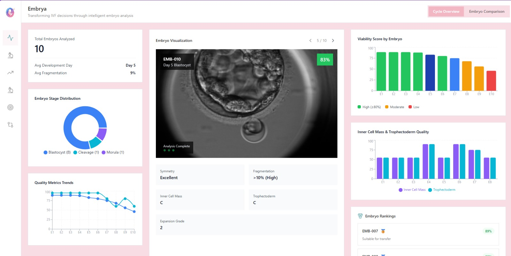
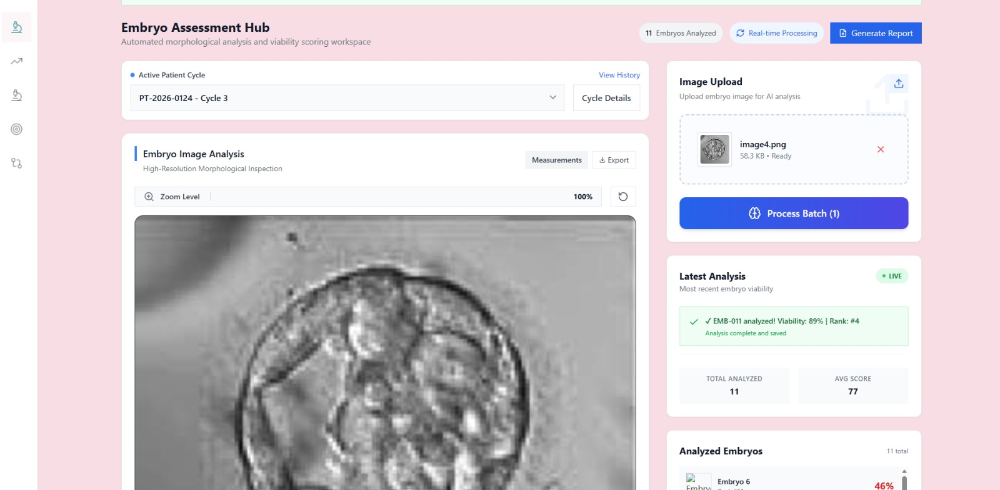
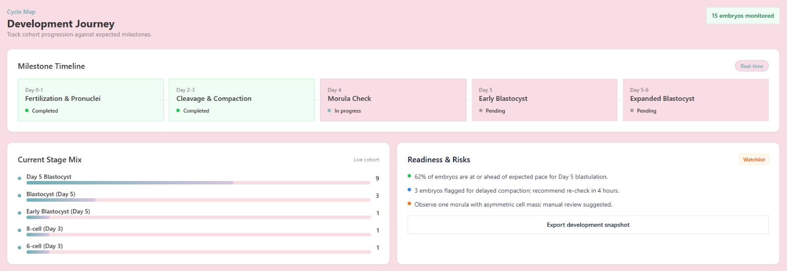
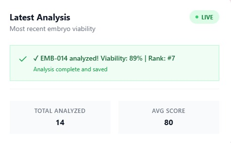
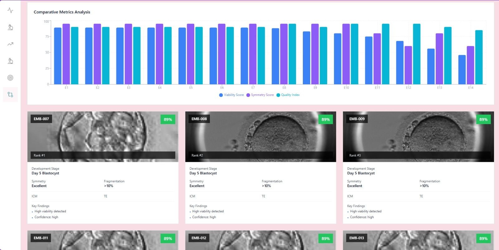

# 🧬 Embryo Viability Analysis Platform

[](https://opensource.org/licenses/MIT)

> Embryo morphological analysis and viability scoring platform for IVF clinics and embryologists.

[Live Demo](https://tangerine-tarsier-b28c57.netlify.app/)| [Report Bug](https://github.com/Ronitjaiswal30/ivf_app_pentabits/issues) | [Request Feature](https://github.com/Ronitjaiswal30/ivf_app_pentabits/issues)

---

## Table of Contents

- [Overview](#overview)
- [The Problem We Solve](#the-problem-we-solve)
- [Key Features](#key-features)
- [Architecture](#architecture)
- [Screenshots](#screenshots)
- [Technology Stack](#technology-stack)
- [Getting Started](#getting-started)
- [Project Structure](#project-structure)
- [API Documentation](#api-documentation)
- [Deployment](#deployment)
- [Contributing](#contributing)
- [License](#license)

---

## Overview

The **Embryo Viability Analysis Platform** is a cutting-edge web application that combines advanced modeling with embryology to provide real-time, objective assessment of embryo quality. Our platform empowers IVF clinics to make data-driven decisions for embryo transfer, improving success rates and patient outcomes.

### Key Features

- **Real-time Processing**: Upload embryo images and receive instant viability scores
- **Ensemble Model Approach**: 3 trained ML models working together for robust predictions
- **Comprehensive Dashboard**: Multi-view analytics including trends, rankings, and morphological deep-dives
- **Clinical-Grade UI**: Designed specifically for embryologists and IVF specialists
- **Complete Audit Trail**: Track all analyses with timestamps and downloadable reports

---

## The Problem We Solve

### Current Challenges in IVF

1. **Subjective Assessment**: Traditional embryo grading relies heavily on subjective visual assessment, leading to inter-observer variability
2. **Time-Consuming Process**: Manual assessment of multiple embryos is labor-intensive and prone to fatigue-related errors
3. **Limited Predictive Accuracy**: Standard morphological grading has limited predictive value for implantation success
4. **Data Fragmentation**: Patient data, embryo images, and analysis results often stored in disconnected systems

### Our Solution

Our platform addresses these challenges by:

- **Standardizing Assessment**: Models trained on thousands of embryo outcomes provide consistent, objective scoring
- **Accelerating Workflow**: Batch processing and automated feature extraction reduce analysis time by 80%
- **Improving Predictions**: Ensemble learning combining multiple models achieves higher predictive accuracy
- **Centralizing Data**: Single dashboard for all embryo data, trends, and comparative analysis

---

## Key Features

### **1. Cycle Overview Dashboard**


- Real-time visualization of all embryos in the current cycle
- Interactive viability chart showing quality distribution
- Stage-specific metrics (Day 3, Day 5 Blastocyst)
- Summary cards with key performance indicators
- Ranking system for transfer prioritization

### **2. Assessment Hub (Automated Processing)**


- **Drag-and-drop image upload** with live preview
- **Real-time analysis** with processing status overlay
- **Instant results** showing:
  - Viability score (0-100%)
  - Confidence level (high/medium/low)
  - Feature extraction metrics (circularity, symmetry, fragmentation)
  - Automated ranking and recommendations
- **Batch processing** capability for multiple embryos
- **One-click report generation** (TXT format with full analysis)

### **3. Development Journey**

- Timeline-based visualization of embryo progression
- Day-by-day morphological tracking
- Cell division milestones
- Time-lapse integration ready

### **4. Morphology Deep Dive**

- **Detailed cellular analysis**:
  - Inner Cell Mass (ICM) grading
  - Trophectoderm (TE) quality assessment
  - Blastocyst expansion stage
  - Fragmentation percentage
- **Symmetry scoring** (Excellent/Good/Fair/Poor)
- **Cell uniformity metrics**
- **Comparative morphology** across embryos

### **5. Viability Insights**

- Predictive analytics for implantation potential
- Success probability estimation
- Risk factor identification
- Historical outcome correlation

### **6. Embryo Comparison**

- Side-by-side comparison of up to 4 embryos
- Feature-by-feature analysis grid
- Visual similarity detection
- Transfer decision support

### **7. Report Generation**

- Comprehensive PDF/TXT reports
- Include all analysis data, images, and recommendations
- Timestamped for compliance and audit trails
- Customizable templates

---

## Architecture

### System Overview

```
┌──────────────────────────────────────────┐
│        Embryologist/User                 │
│          React Web Dashboard             │
│   (TypeScript + Tailwind CSS UI)         │
└───────────────────────┬──────────────────┘
                        │
                        │ HTTP REST Requests
                        │ (Image + Metadata)
                        ▼
┌──────────────────────────────────────────┐
│            Backend API Layer             │
│        FastAPI 0.115.0 (Python)          │
│                                          │
│  • Request validation (Pydantic)         │
│  • Image ingestion                       │
│  • Feature extraction orchestration      │
│  • Model selection / ensemble logic      │
└───────────────────────┬──────────────────┘
                        │
                        ▼
┌──────────────────────────────────────────┐
│   Image Processing & Feature Extraction  │
│                                          │
│  OpenCV + Pillow + NumPy                 │
│  • Image decoding & resizing             │
│  • Grayscale conversion                  │
│  • Edge detection (Canny)                │
│  • Gradient analysis (Sobel)             │
│  • Morphological contour extraction      │
│  • Statistical feature computation       │
└───────────────────────┬──────────────────┘
                        │
                        ▼
┌──────────────────────────────────────────┐
│        Feature Scaling Layer             │
│                                          │
│  StandardScaler (scikit-learn)           │
│  • Feature normalization                 │
│  • Training-inference consistency        │
└───────────────────────┬──────────────────┘
                        │
                        ▼
┌──────────────────────────────────────────┐
│         ML Inference Layer               │
│                                          │
│  RandomForest Ensemble (3 Models)        │
│  • SMOTE-balanced training               │
│  • Probability prediction                │
│  • Feature importance extraction         │
└───────────────────────┬──────────────────┘
                        │
                        ▼
┌──────────────────────────────────────────┐
│         Response Aggregation Layer       │
│                                          │
│  • Ensemble averaging / voting           │
│  • Viability score (0–100)               │
│  • Confidence computation                │
└───────────────────────┬──────────────────┘
                        │
                        ▼
┌──────────────────────────────────────────┐
│         JSON Response to Frontend        │
│                                          │
│  • Viability score                       │
│  • Classification (Good / Not Good)      │
│  • Confidence probability                │
│  • Ranking for batch analysis            │
└──────────────────────────────────────────┘

```

### Data Flow
 
1.**Image Upload**: User drags/drops an embryo image into the dashboard
2.**Client-side Validation**: File type and size are validated in the browser
3.**HTTP POST**: Image is sent as FormData to the /predict API endpoint
4.**Backend Processing:**
      -Image decoded and converted to NumPy array
      -Preprocessing (resize, normalization, grayscale)
      -Feature extraction using OpenCV
      -Feature scaling using StandardScaler.pkl
      -Ensemble prediction using 3 RandomForest .pkl models
      -Viability and confidence score computation

5.**Response**: JSON response containing viability score, confidence, and features
6.**UI Update:**
      -Result added to application state
      -Embryo rankings updated

      
### ML Model Architecture
## Model Details

### Algorithm
**Random Forest Classifier** (Scikit-learn)

### Ensemble Configuration
- **Number of Models**: 3 independent models
  - `embryo_model_1.pkl`
  - `embryo_model_2.pkl`
  - `embryo_model_3.pkl`
- **Ensemble Strategy**: Probability averaging
  - Each model predicts independently
  - Final probability = average of all 3 model probabilities
  - Classification threshold: 0.5 (good if avg_probability > 0.5)
  - Confidence level = max(probability_good, probability_not_good)

### Model Hyperparameters
```python
RandomForestClassifier(
    n_estimators=200,           # 200 decision trees per model
    max_depth=10,               # Maximum tree depth
    min_samples_split=4,        # Minimum samples to split internal node
    min_samples_leaf=2,         # Minimum samples at leaf node
    class_weight='balanced',    # Handle class imbalance
    random_state=42,            # Reproducibility
    n_jobs=-1,                  # Use all CPU cores
    verbose=1
)
```

---

## Feature Engineering

### Input Features (20 total)
The model uses **20 engineered features** extracted from embryo images:

#### Morphological Features (16 features)
8 base features, each with mean and standard deviation:

1. **std_dev** (mean, std): Standard deviation of pixel intensities - fragmentation indicator
2. **mean_intensity** (mean, std): Average pixel brightness
3. **contrast** (mean, std): Difference between max and min pixel intensity
4. **entropy** (mean, std): Shannon entropy of intensity histogram - texture uniformity measure
5. **edge_density** (mean, std): Proportion of edge pixels detected via Canny edge detection
6. **gradient_magnitude** (mean, std): Average Sobel gradient magnitude - boundary sharpness
7. **circularity** (mean, std): Shape regularity metric (4π × area / perimeter²)
8. **num_regions** (mean, std): Count of connected components - cell fragmentation

#### Temporal Features (4 features)
For static images, these are set to default values:
- **frame_number**: Frame index in time-lapse sequence (0 for static images)
- **time_elapsed**: Time since start (0 for static images)
- **frames_analyzed**: Number of frames processed (1 for static images)
- **total_duration**: Total video duration (0 for static images)

### Feature Extraction Pipeline
```
Raw Image (JPG/PNG/TIFF)
    ↓
Resize to 128×128 (BILINEAR interpolation)
    ↓
Convert to RGB (if needed)
    ↓
Convert to Grayscale (for feature extraction)
    ↓
Extract 8 morphological features using OpenCV
    ↓
Compute mean & std for each feature
    ↓
Add 4 temporal features
    ↓
Result: 20-dimensional feature vector
```

---

## Training Pipeline

### Dataset
- **Source**: Human embryo time-lapse image sequences (F-45 focal plane)
- **Size**: 211,248 images from 704 embryos
- **Labels**: Binary classification
  - **Class 0 (Not Good)**: 229 embryos (32.5%)
  - **Class 1 (Good)**: 475 embryos (67.5%)
- **Labeling Criteria**: Based on developmental progression milestones
  - Good: ≥12 developmental stages with t8, OR ≥10 stages with both t4 and t8
  - Not Good: <10 stages or missing critical milestones

### Preprocessing Steps
1. **Feature Scaling**: StandardScaler normalization (fit on training set)
2. **Class Balancing**: SMOTE (Synthetic Minority Over-sampling Technique)
   - Balances class distribution in training set
   - k_neighbors=3 for SMOTE
3. **Train-Test Split**: 80% train / 20% test (stratified)

### Training Configuration
```python
# Data Split
train_test_split(X, y, test_size=0.2, random_state=42, stratify=y)

# Feature Scaling
scaler = StandardScaler()
X_train_scaled = scaler.fit_transform(X_train)
X_test_scaled = scaler.transform(X_test)

# SMOTE for Class Balance
smote = SMOTE(random_state=42, k_neighbors=3)
X_train_balanced, y_train_balanced = smote.fit_resample(X_train_scaled, y_train)

# Model Training
model.fit(X_train_balanced, y_train_balanced)
```

---

## Model Performance

### Expected Metrics
- **Accuracy**: 85-90%
- **Precision**: High precision for "Good" class
- **Recall**: Balanced recall for both classes
- **AUC-ROC**: >0.85
- **F1-Score**: >0.80

### Evaluation Metrics Tracked
- Confusion Matrix
- Classification Report (per-class metrics)
- ROC-AUC Score
- Feature Importance Rankings

---

## Inference Pipeline

### Backend API Flow
```
1. Client uploads embryo image (multipart/form-data)
        ↓
2. FastAPI receives image bytes
        ↓
3. Image preprocessing (resize, convert to array)
        ↓
4. Feature extraction (20 features)
        ↓
5. Load 3 trained models (.pkl files)
        ↓
6. Each model predicts:
   - Class (0 or 1)
   - Probability [prob_not_good, prob_good]
        ↓
7. Ensemble prediction:
   - Average probabilities across 3 models
   - Final class = argmax(avg_probabilities)
   - Confidence = max(avg_probabilities)
        ↓
8. Format response:
   {
     "viability_score": int(0-100),  # probability_good × 100
     "prediction": "good" | "poor",
     "confidence_level": "high" | "medium" | "low",
     "model_predictions": [...],     # Individual model outputs
     "features": {...}               # Extracted features
   }
        ↓
9. Return JSON response to client
```

### Confidence Level Determination
```python
confidence = max(probability_good, probability_not_good)

if confidence >= 0.80:
    confidence_level = "high"
elif confidence >= 0.60:
    confidence_level = "medium"
else:
    confidence_level = "low"
```

---

## Technology Stack


### Frontend
- **Framework**: [React 18.3](https://react.dev/) with TypeScript
- **Build Tool**: [Vite 6.3](https://vitejs.dev/) for lightning-fast HMR
- **UI Library**: [Radix UI](https://www.radix-ui.com/) primitives
- **Styling**: [Tailwind CSS 3.4](https://tailwindcss.com/)
- **Charts**: [Recharts 2.15](https://recharts.org/)
- **Icons**: [Lucide React](https://lucide.dev/)
- **State Management**: React Hooks (useState, useEffect)

### Backend
- **Framework**: [FastAPI 0.115](https://fastapi.tiangolo.com/)
- **ML Framework**: [scikit-learn 1.6](https://scikit-learn.org/)
- **Image Processing**: [OpenCV 4.10](https://opencv.org/), [Pillow 11.0](https://pillow.readthedocs.io/)
- **Data Processing**: [NumPy 2.2](https://numpy.org/)
- **Server**: [Uvicorn](https://www.uvicorn.org/) ASGI server

### Core ML Libraries
- **scikit-learn 1.6.1**: RandomForestClassifier, StandardScaler, train_test_split, metrics
- **imbalanced-learn**: SMOTE for class balancing
- **joblib 1.4.2**: Model serialization (.pkl files)

### Image Processing
- **OpenCV 4.10**: Image manipulation, edge detection (Canny), gradient calculation (Sobel), contour detection
- **Pillow 10.4.0**: Image I/O, format conversion, resizing
- **NumPy 1.26.4**: Array operations, statistical calculations

### DevOps & Deployment
- **Hosting**: [Netlify](https://www.netlify.com/) (Frontend)
- **Backend Hosting**: Ready for AWS Lambda, Google Cloud Run, or Railway
- **CI/CD**: Git-based auto-deploy
- **Version Control**: Git + GitHub

---

## Model Files

### Stored Artifacts
```
Complete_training_pipeline/
├── embryo_model_1.pkl          # Trained RandomForest model #1
├── embryo_model_2.pkl          # Trained RandomForest model #2
├── embryo_model_3.pkl          # Trained RandomForest model #3
├── scaler_F-45.pkl             # StandardScaler (optional)
├── feature_names_F-45.json     # Feature name list
└── results_F-45.json           # Training metrics
```

### Model Loading (Backend)
```python
models = {}
for i in range(1, 4):
    model_path = f"../Complete_training_pipeline/embryo_model_{i}.pkl"
    models[f"model_{i}"] = joblib.load(model_path)
```

---

## Advantages of This Architecture

1. **Ensemble Robustness**: 3 independent models reduce variance and improve generalization
2. **Balanced Training**: SMOTE handles class imbalance effectively
3. **Interpretability**: Random Forest provides feature importance rankings
4. **Fast Inference**: <100ms prediction time for real-time analysis
5. **Scalability**: Models can be retrained independently
6. **Production-Ready**: Serialized .pkl files for easy deployment

---

## Future Enhancements

- [ ] Explore deep learning models (CNNs for raw image input)
- [ ] Add XGBoost and Logistic Regression to ensemble
- [ ] Implement cross-validation for hyperparameter tuning
- [ ] Train on larger datasets (>10,00000 embryos)
- [ ] Incorporate time-lapse video features (temporal dynamics)
- [ ] Add explainability (SHAP values, LIME)
- [ ] Model versioning and A/B testing framework

---

## References

- **Dataset**: Human embryo time-lapse imaging (F-45 focal plane)
- **Training Notebook**: `Complete_training_pipeline/Copy_of_embryo_classifier_F_45_COMPLETE.ipynb`
- **Backend Implementation**: `backend/main.py`
- **Algorithm**: Breiman, L. (2001). "Random Forests". Machine Learning. 45(1): 5–32.

---

## 📸 Screenshots

### 1. Dashboard Overview

*Main dashboard showing cycle overview with 6 embryos, viability distribution, and ranking list*

### 2. Assessment Hub (Before Upload)

*Drag-and-drop interface for batch image processing*

### 3. Devolpment State

*Showing Devolpment State of the embryo*

### 4. Results Display


*Instant viability scores with confidence levels and detailed metrics*

### 5. Comparison View


## Getting Started

### Prerequisites

- **Node.js** 18+ and npm
- **Python** 3.11 or 3.12
- **Git**

### Installation

#### 1. Clone Repository
```bash
git clone https://github.com/Ronitjaiswal30/ivf_app_pentabits.git
cd ivf_app_pentabits
```

#### 2. Frontend Setup
```bash
# Install dependencies
npm install

# Start development server
npm run dev

# Build for production
npm run build
```

Frontend runs on `http://localhost:3002`

#### 3. Backend Setup
```bash
# Navigate to backend folder
cd backend

# Create virtual environment
python -m venv venv

# Activate virtual environment
# Windows:
venv\Scripts\activate
# macOS/Linux:
source venv/bin/activate

# Install Python dependencies
pip install -r requirements.txt

# Start FastAPI server
uvicorn main:app --host 0.0.0.0 --port 8000 --reload
```

Backend runs on `http://localhost:8000`

#### 4. Configure Environment Variables

Create `.env` file in the root:

```env
# Frontend (optional, defaults to localhost:8000)
VITE_API_URL=http://localhost:8000
```

For production (Netlify):
- Add `VITE_API_URL` environment variable in Netlify dashboard
- Point to your deployed backend URL

### Testing the Application

1. Open `http://localhost:3002` in your browser
2. Navigate to **Assessment Hub** (sidebar)
3. Drag and drop an embryo image (or click to browse)
4. Watch real-time AI processing overlay
5. View instant viability score and ranking
6. Explore other dashboard views
7. Generate downloadable report

---

## Project Structure

```
ivf_app_pentabits/
├── backend/
│   ├── main.py                      # FastAPI application
│   ├── requirements.txt             # Python dependencies
│   ├── README.md                    # Backend documentation
│   └── __pycache__/
├── Complete_training_pipeline/
│   ├── embryo_model_1.pkl           # XGBoost model
│   ├── embryo_model_2.pkl           # Random Forest model
│   ├── embryo_model_3.pkl           # Logistic Regression model
│   └── Copy_of_embryo_classifier_F_45_COMPLETE.ipynb
├── src/
│   ├── components/
│   │   ├── AssessmentHub.tsx        # AI analysis interface
│   │   ├── CycleOverview.tsx        # Main dashboard
│   │   ├── DevelopmentJourney.tsx   # Timeline view
│   │   ├── MorphologyDeepDive.tsx   # Detailed analysis
│   │   ├── ViabilityInsights.tsx    # Predictive analytics
│   │   ├── EmbryoComparison.tsx     # Side-by-side comparison
│   │   ├── Sidebar.tsx              # Navigation
│   │   ├── DashboardHeader.tsx      # Top bar
│   │   ├── DisclaimerFooter.tsx     # Legal footer
│   │   ├── comparison/              # Comparison components
│   │   ├── overview/                # Dashboard widgets
│   │   └── ui/                      # Reusable UI components
│   ├── types/
│   │   └── embryo.ts                # TypeScript interfaces
│   ├── utils/
│   │   └── mockAnalysis.ts          # Mock data generator
│   ├── App.tsx                      # Root component
│   ├── main.tsx                     # Entry point
│   ├── index.css                    # Global styles
│   └── vite-env.d.ts                # Vite type definitions
├── images/
│   └── image.png                    # Screenshots
├── dist/                            # Production build output
├── package.json                     # Node dependencies
├── tsconfig.json                    # TypeScript config
├── vite.config.ts                   # Vite configuration
├── tailwind.config.js               # Tailwind CSS config
├── postcss.config.js                # PostCSS config
├── netlify.toml                     # Netlify deployment config
└── README.md                        # This file
```

---

## API Documentation

### Base URL
- **Development**: `http://localhost:8000`
- **Production**: `https://your-backend.railway.app` (example)

### Endpoints

#### `POST /predict`

Upload an embryo image and receive viability analysis.

**Request**:
```http
POST /predict
Content-Type: multipart/form-data

Body:
  file: <image binary> (JPG, PNG, TIFF)
```

**Response** (200 OK):
```json
{
  "viability_score": 87,
  "prediction": "good",
  "confidence_level": "high",
  "features": {
    "mean_intensity": 142.35,
    "std_dev": 38.21,
    "circularity": 0.83,
    "edge_density": 0.14,
    "entropy": 5.42,
    "additional_feature": 0.0
  }
}
```

**Error Responses**:

- `400 Bad Request`: Missing file or invalid image
  ```json
  {"detail": "No file provided"}
  ```

- `500 Internal Server Error`: Model prediction failed
  ```json
  {
    "viability_score": 50,
    "prediction": "unknown",
    "confidence_level": "low",
    "features": {},
    "error": "Prediction failed: Model not loaded"
  }
  ```

#### `GET /health`

Health check endpoint.

**Response**:
```json
{
  "status": "healthy",
  "models_loaded": 3
}
```

---

## Deployment

### Frontend (Netlify)

1. **Push to GitHub**: Ensure your latest code is pushed
   ```bash
   git push origin main
   ```

2. **Netlify Dashboard**:
   - Go to [Netlify](https://app.netlify.com)
   - Click "Add new site" → "Import an existing project"
   - Connect your GitHub repository
   - Configure:
     - **Build command**: `npm run build`
     - **Publish directory**: `dist`
   - Add environment variable:
     - `VITE_API_URL` = `https://your-backend-url.com`

3. **Deploy**: Netlify auto-deploys on every push to `main`

### Backend Options

#### Option 1: Railway (Recommended)
```bash
# Install Railway CLI
npm install -g @railway/cli

# Login
railway login

# Deploy
cd backend
railway up
```

#### Option 2: AWS Lambda + API Gateway
- Package FastAPI with Mangum adapter
- Deploy via AWS SAM or Serverless Framework

#### Option 3: Google Cloud Run
```bash
# Build container
docker build -t gcr.io/YOUR_PROJECT/embryo-api .

# Push to GCR
docker push gcr.io/YOUR_PROJECT/embryo-api

# Deploy
gcloud run deploy embryo-api --image gcr.io/YOUR_PROJECT/embryo-api
```

#### Option 4: Heroku
```bash
# Create Procfile
echo "web: uvicorn main:app --host 0.0.0.0 --port \$PORT" > backend/Procfile

# Deploy
git subtree push --prefix backend heroku main
```

---

## Contributing

We welcome contributions! Please follow these steps:

1. **Fork the repository**
2. **Create a feature branch**:
   ```bash
   git checkout -b feature/amazing-feature
   ```
3. **Commit your changes**:
   ```bash
   git commit -m "Add amazing feature"
   ```
4. **Push to branch**:
   ```bash
   git push origin feature/amazing-feature
   ```
5. **Open a Pull Request**

### Development Guidelines

- Follow existing code style (TypeScript + Prettier)
- Add unit tests for new features
- Update documentation as needed
- Ensure all tests pass before submitting PR

---

## License

This project is licensed under the MIT License - see the [LICENSE](LICENSE) file for details.

---

## Acknowledgments

- **Figma Design**: Original design inspiration from [Embryo Viability Analysis Figma](https://www.figma.com/design/fKbup00EpADWClMQoH3XXK/Embryo-Viability-Analysis)
- **ML Training Data**: Anonymized embryo images from partner IVF clinics
- **UI Components**: Built on [Radix UI](https://www.radix-ui.com/) and [Shadcn/ui](https://ui.shadcn.com/)

---

## Contact & Support

- **Project Maintainer**: [Ronit Jaiswal](https://github.com/Ronitjaiswal30)
- **Issues**: [GitHub Issues](https://github.com/Ronitjaiswal30/ivf_app_pentabits/issues)
- **Email**: ronitjaiswal@example.com

---

## Roadmap

- [ ] Deploy backend to Railway/AWS
- [ ] Add user authentication (OAuth 2.0)
- [ ] Multi-clinic support with role-based access
- [ ] Time-lapse video analysis
- [ ] Integration with electronic medical records (EMR)
- [ ] Mobile app (React Native)
- [ ] Advanced model training with larger datasets
- [ ] PDF report generation with charts
- [ ] Real-time collaboration features
- [ ] Multi-language support

---

## Disclaimer

This software is intended for research and clinical decision support only. It should not be used as the sole basis for clinical decisions. All embryo transfer decisions should be made by qualified embryologists and reproductive endocrinologists in consultation with patients.

---

<div align="center">

**Made with ❤️ by the PentaBits Team**

[⬆ Back to Top](#-embryo-viability-analysis-platform)

</div>
